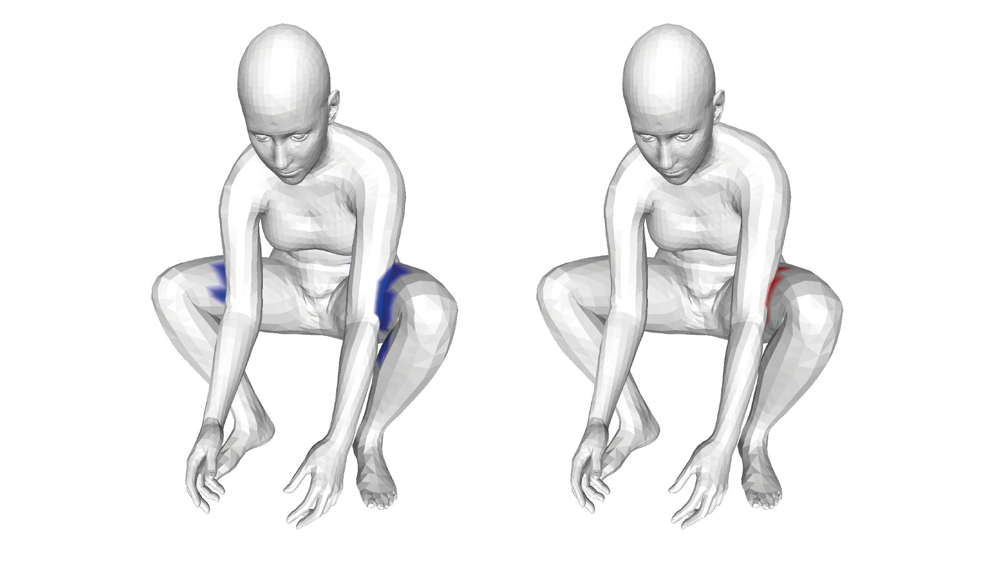
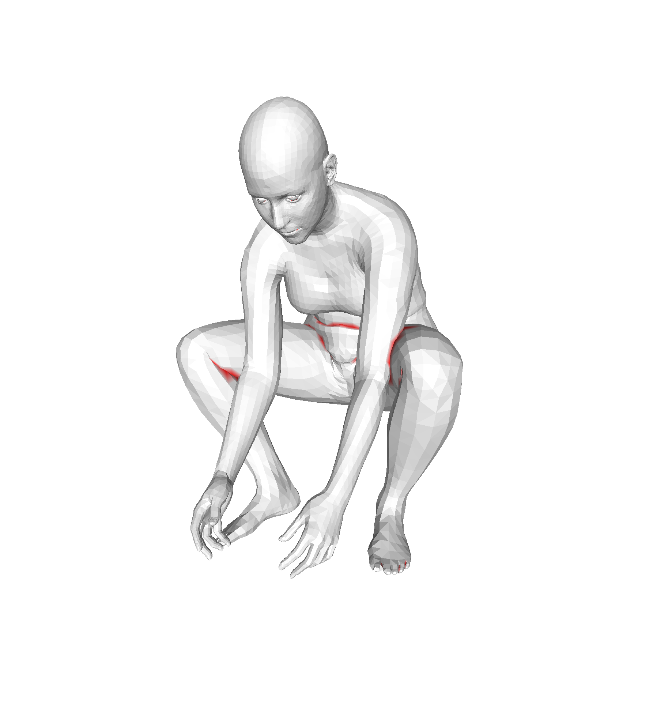
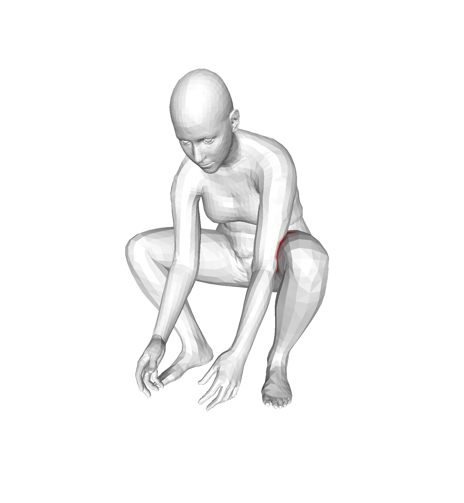

# selfcontact
This repo is part of our project: On Self-Contact and Human Pose. \
[[Project Page](https://tuch.is.tue.mpg.de)] [[Paper](https://arxiv.org/pdf/2104.03176.pdf)] [[MPI Project Page](https://www.is.mpg.de/publications/mueller-cvpr-2021)]

It includes the main function to segment the SMPL and SMPL-X meshes into inside / outside / in-contact vertices.
It includes contact losses that are used with SMPLify-XMC and TUCH.

<p float="left">

</p>
Vertices in contact (blue) based on geodesic and euclidean distances. In this example, the geodesic threshold is 30 cm and the euclidean threshold is 2 cm.
In red, detected self-intersecting vertices with segment tests. 

## License
Software Copyright License for **non-commercial scientific research purposes**. Please read carefully the following [terms and conditions](./LICENSE) and 
any accompanying documentation before you download and/or use the TUCH data and software, (the "Data & Software"), including 3D meshes, images, videos, textures, software, scripts, and animations. 
By downloading and/or using the Data & Software (including downloading, cloning, installing, and any other use of the corresponding github repository), you acknowledge that you have read these 
terms and conditions, understand them, and agree to be bound by them. If you do not agree with these terms and conditions, you must not download and/or use the Data & Software. Any infringement 
of the terms of this agreement will automatically terminate your rights under this [License](./LICENSE).

## Installation

#### 1) Clone this repository 
```
git clone git@github.com:muelea/selfcontact.git
cd selfcontact
```

#### 2) Create python virtual environment and install requirements
```
python3 -m venv $YOUR_VENV_DIR/selfcontact
source $YOUR_VENV_DIR/selfcontact/bin/activate
pip install -r requirements.txt
```
To use the repo as python module, use `pip install .` instead and move on with step 3).

#### 3) Download essentials
Download the essentials from [here](https://download.is.tue.mpg.de/tuch/selfcontact-essentials.zip). These files are required and include for example the 
precomputed geodesic distances for the neutral SMPL-X and SMPL body modles. Unpack the essentions to ESSENTIALS_FOLDER


#### 5) Run example script to test for self-intersections
```
# vertices in contact
python selfcontact/tutorial/find_vertices_in_contact.py --essentials_folder ESSENTIALS_FOLDER --output_folder OUPUT_FOLDER
# intersecting vertices
python selfcontact/tutorial/find_self_intersecting_vertices.py --essentials_folder ESSENTIALS_FOLDER --output_folder OUPUT_FOLDER
```
 \
Mesh with result inside / outside segmentation WITHOUT segment tests. Note, how natural intersections, e.g. in the belly or crook regions are detected. 

 \
Mesh with result inside / outside segmentation WITH segment tests. With segment testing, these self-intersections are ignored.


#### 5) Run example script to test for self-intersections
Run the self-contact optimization:
python selfcontact/tutorial/run_selfcontact_optimization.py --essentials_folder ESSENTIALS_FOLDER --model_folder MODEL_FOLDER --output_folder OUTPUT_FOLDER
--config selfcontact/tutorial/configs/selfcontact_optimization_config_orig.yaml

If you want to enable segment testing set the test_segments parameter to True. Please not, that we did not use segment tests in the original paper. With segment testing the optimization is more stable, but the hyperparameters are not tuned.

## Citation
```
@inproceedings{Mueller:CVPR:2021,
  title = {On Self-Contact and Human Pose},
  author = {M{\"u}ller, Lea and Osman, Ahmed A. A. and Tang, Siyu and Huang, Chun-Hao P. and Black, Michael J.},
  booktitle = {Proceedings IEEE/CVF Conf.~on Computer Vision and Pattern Recogßnition (CVPR)},
  month = jun,
  year = {2021},
  doi = {},
  month_numeric = {6}
}
```


## Acknowledgement 

We thank Vassilis Choutas for his implementation of the generalized winding numbers.


## Contact

For questions, please contact tuch@tue.mpg.de

For commercial licensing (and all related questions for business applications), please contact ps-licensing@tue.mpg.de.